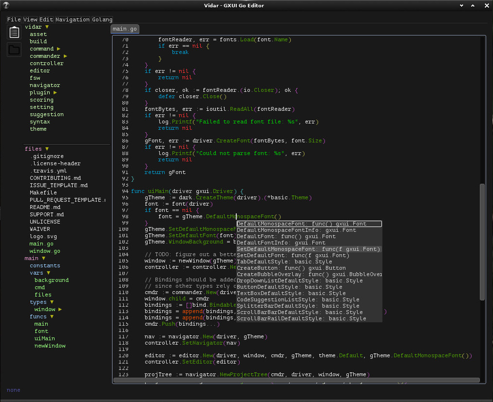

# vidar

[](https://travis-ci.org/nelsam/vidar)
[](https://gitter.im/nelsam/vidar?utm_source=badge&utm_medium=badge&utm_campaign=pr-badge&utm_content=badge)
[](https://goreportcard.com/report/github.com/nelsam/vidar)

[](http://waffle.io/nelsam/vidar)

Vidar is the Norse god of silence, patience, and revenge.  Sounds perfect for an editor, right?


## Screenshot



Vidar is a text editor written in go, designed for writing go.  It supports plugins, performs reasonably
well, and has some nice go-specific features that help with navigating go code.  While I don't think it's
going to replace your favorite editor, I am pretty damn proud of what we've got, and I think it will
support most use cases fairly well.  Panics are caught before any in-progress work is lost most of the
time (we prioritize fixing those problems quickly), input is reasonably responsive, the usual editor
features (copy/paste, find, regexp find, etc) are mostly working as you'd expect, and language-specific
features can be loaded per file.

## Quick start

- [Install GXUI's C dependencies](https://github.com/google/gxui#dependencies)

```
$ go get github.com/nelsam/vidar
$ vidar
```

If you're running linux, you will also probably want to install plugins, since most go-specific features
are kept out of the main editor source code.  See [the Makefile](/Makefile) for plugin build and install
commands.

Other OSes will currently get all the go plugins baked directly into the binary.

### Go Version

I'm only supporting the latest stable version of Go.  This doesn't necessarily mean that vidar
won't work with older versions, but I promise nothing.

### Optional Dependencies

- [gocode](https://github.com/nsf/gocode) - needed for the `gocode` plugin to work
- [goimports](https://godoc.org/golang.org/x/tools/cmd/goimports) - needed for the `goimports` plugin to work
  - This will some day be configurable, but it currently is not
- [godef](https://github.com/rogpeppe/godef) - needed for the `godef` plugin to work

## Configuration

Vidar uses [xdg-go](https://github.com/casimir/xdg-go) to decide where to save config
files.  On linux systems, this will probably end up in `~/.config/vidar/`; for Windows
and OS X, you'll likely need to check the xdg-go package to see what it uses.

Config files are written as `toml` by default, but can be parsed from any format that
[viper](https://github.com/spf13/viper) supports.  Currently, there are three config
files:
- settings: Only used to configure a `fonts` list, which should be a list of names
  of fonts installed on your system in order of preference.  Note that only truetype
  fonts are supported right now, and many of those display incorrectly.  My current
  favorites are `Inconsolata-Regular` and `PTM55F`.
- projects: A list of projects with `name`, `path`, and `gopath` keys.  This can be
  added to with the `add-project` command (`ctrl-shift-n` by default).
- keys: The key bindings.  This file will be written on first startup with the default
  key bindings, so you can edit the file with any changes or aliases you'd like.
  Multiple bindings per command are supported.

## History

Vidar started as a repository that I had named `gxui_playground`.  It was quite literally just a place
for me to mess around with [gxui](https://github.com/google/gxui).  Three weeks later, I had something
that I was actually *starting* to use for development.

Vidar is still missing some important features, but it's pretty close to being a fully featured editor.
It's definitely much more respectable for editing go code than for editing other types of files, but
with the plugin system in place, that's less and less a core problem with the editor, and more a problem
with the lack of support from third party plugins.

## Current Features

- Plugins (still linux-only - I'm testing darwin plugin support and watching the upstream
  issues for windows support)
  - [Go syntax highlighting](plugin/gosyntax)
    - Includes rainbow parens
  - [Go to definition in go files (requires godef)](plugin/godef)
  - [Style formatting both on command and on save (requires goimports)](plugin/goimports)
  - [Comment and uncomment block](plugin/comments)
  - [License header tracker - for projects that need the little license comment at the top of each go file](plugin/license)
- Split view (both horizontal and vertical)
- Watch filesystem for changes
  - Events trigger editor elements to reload their text
  - Since this has shown itself to be a bit unreliable, vidar will refuse to write a file that
    has been changed on disk since the last reload.  If this happens, you have to close and re-open
    the file.
- Most of the basic stuff you expect from a text editor (copy/paste, undo/redo, etc)

## Important Missing Features

These are all planned, but have yet to be implemented.

- Plugins on operating systems other than linux.
- Configurability
  - When you open a new project, you can set up some basic configuration in the UI, but very
    little else.
  - Most settings will require editing a config file manually, at the moment.
- Polish
  - There are some frustrating, but difficult-to-solve, bugs lingering around.  I squash them
    when I can, but some of the less annoying ones that either have difficult solutions or are
    difficult to reproduce regularly are going to be there for a while.
  - The biggest source of frustration for me, personally, is related to the find command always
    creating multiple cursors.  At the time of writing, gxui provides no way to highlight a bit of
    text without also selecting it.  There is also no way to scroll to the next/previous match 
    right now, and the matches are not displayed along the scroll bar as they should be.
  - We also need to do a better job of making cursor history work, so that you can go back to
    a previous mark, or mark a selection start and then search for the end.

